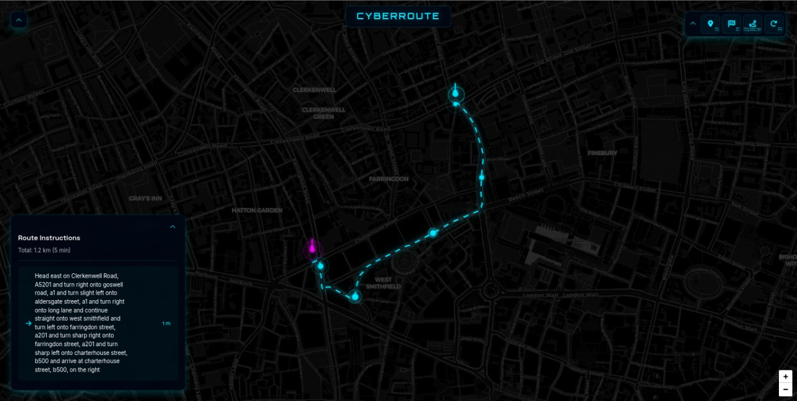

# CyberRoute - Cyberpunk Route Finder

A modern, cyberpunk-themed web application for finding and visualizing routes between two points on a map. Built with Python Flask backend and interactive frontend using Leaflet.js.



## Features

- 🗺️ Interactive map with dark cyberpunk theme
- 🔍 Location search with autocomplete
- 📍 Visual markers with animations
- 🛣️ Animated route visualization
- 💫 Particle effects and node animations
- ⌨️ Keyboard shortcuts for quick actions
- 📱 Responsive design for all devices
- 🎮 Collapsible control panels

## Tech Stack

- **Backend**: Python Flask
- **Frontend**: HTML5, CSS3, JavaScript
- **Map**: Leaflet.js
- **Icons**: Font Awesome
- **Fonts**: Orbitron, Inter, Space Grotesk

## Installation

1. Clone the repository:
```bash
git clone https://github.com/xtle0o0/CyberRoute.git
cd CyberRoute
```

2. Install Python dependencies:
```bash
pip install -r requirements.txt
```

3. Run the Flask application:
```bash
python app.py
```

4. Open your browser and navigate to:
```
http://localhost:5000
```

## Usage

### Keyboard Shortcuts

- `S` - Set start point
- `E` - Set end point
- `Space` - Calculate route
- `R` - Reset map
- `Esc` - Cancel current action

### Mouse Controls

- Click on map to place markers
- Use search panels for location lookup
- Collapse/expand panels with chevron buttons
- Hover over buttons for tooltips

## Project Structure

```
cyberroute/
├── app.py              # Flask application
├── requirements.txt    # Python dependencies
├── static/            # Static assets
└── templates/         # HTML templates
    └── index.html     # Main application template
```

## License

This project is licensed under the MIT License - see the [LICENSE](LICENSE) file for details.

## Acknowledgments

- Map tiles by [CARTO](https://carto.com/)
- Icons by [Font Awesome](https://fontawesome.com/)
- Fonts by [Google Fonts](https://fonts.google.com/)
